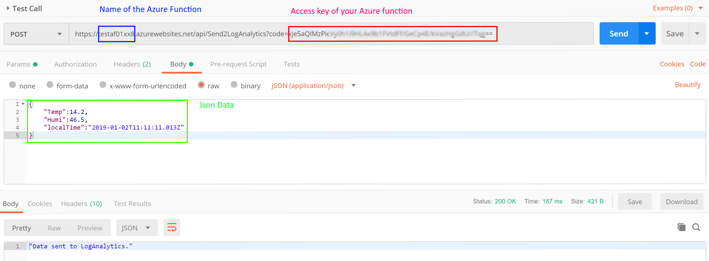
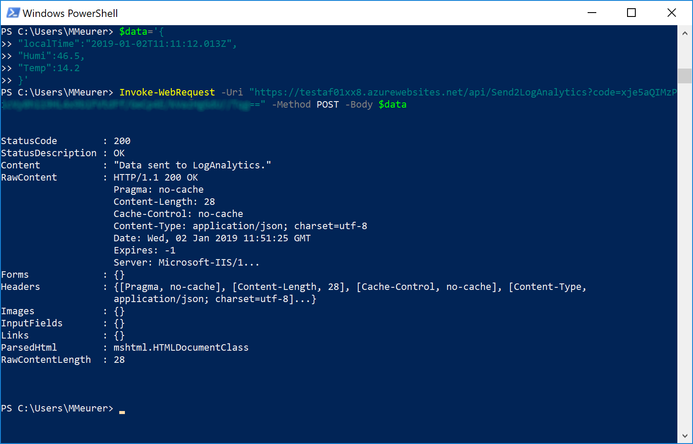
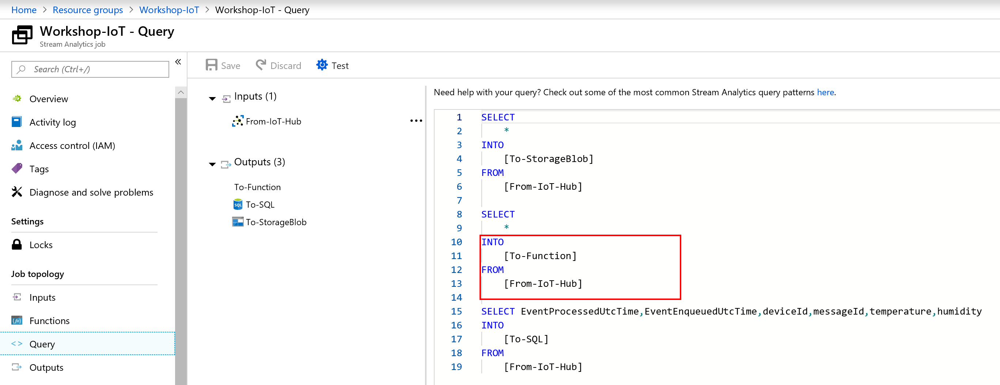
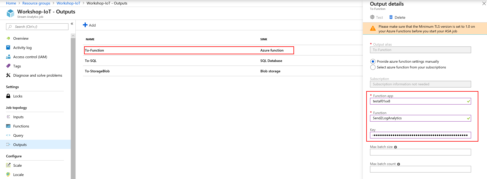
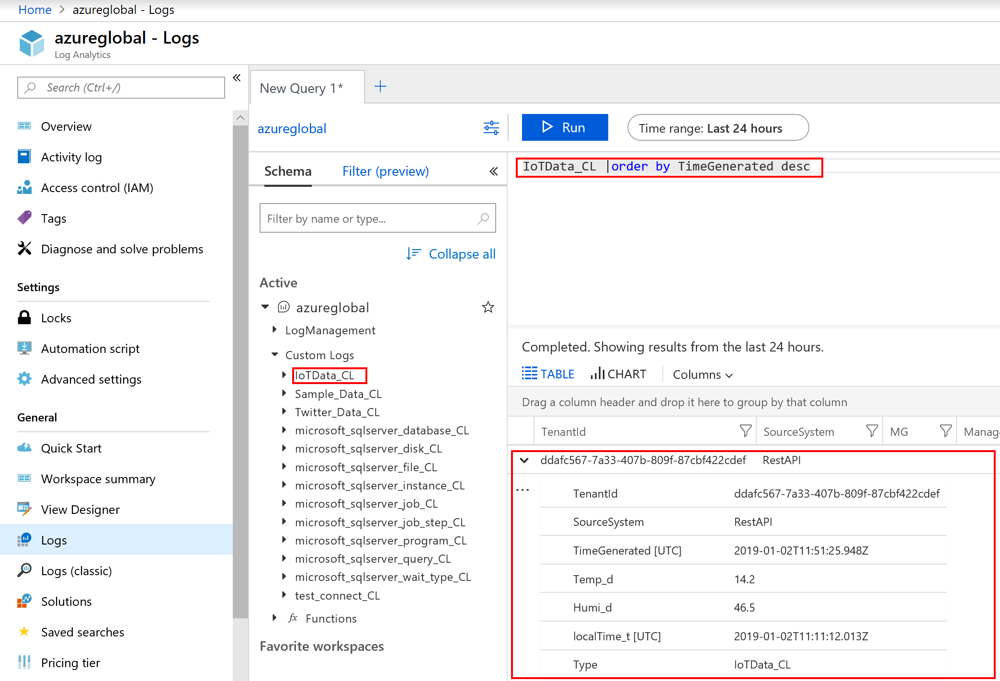
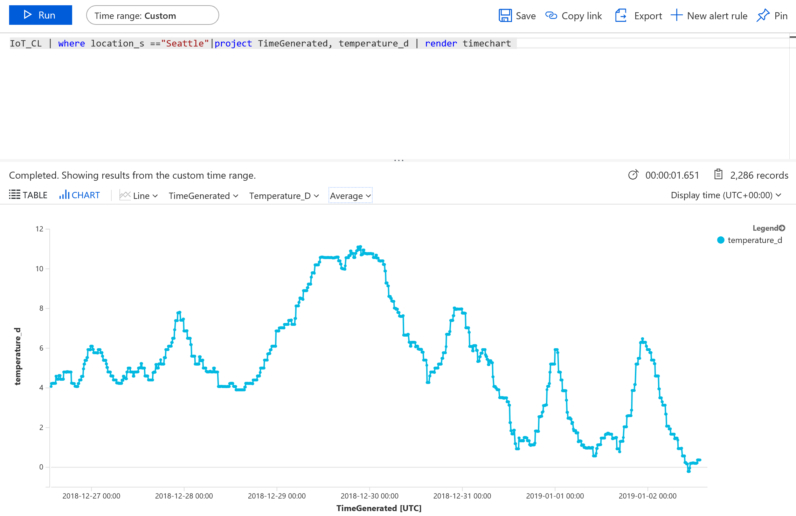
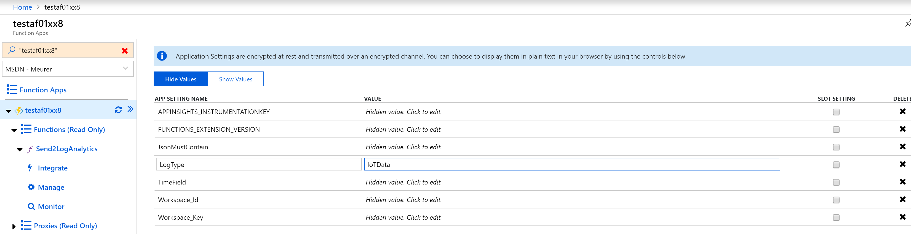
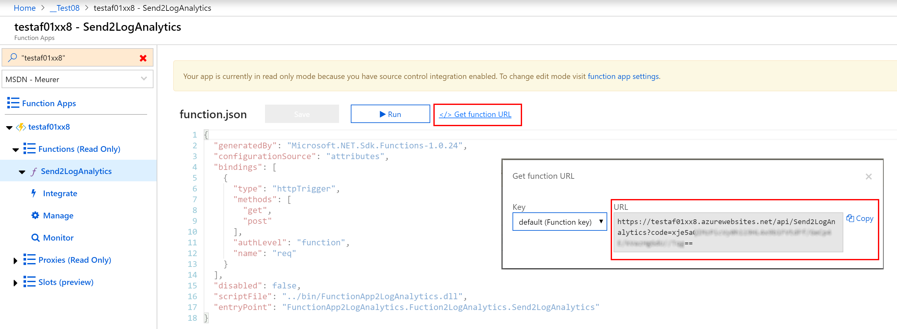

# Deploy to Azure

 <a href="https://portal.azure.com/#create/Microsoft.Template/uri/https%3A%2F%2Fraw.githubusercontent.com%2FMarcelMeurer%2FFunctionApp-to-LogAnalytics%2Fmaster%2Ftemplate.json" target="_blank"></a>

# Introduction

Microsoft offers with Log Analytics a cloud based big data service. Log Analytics is used by several services (including Azure itself) to log and analyze data. It’s a core component of Azure Monitor and Application Insights.

Log Analytics key facts:

\-          Cloud based

\-          No data aggregation

\-          Pay per upload and data retention

\-          Powerful query language (kql: <https://docs.microsoft.com/en-us/azure/kusto/>)

\-          Direct support for visualization on portal.azure.com

I use Log Analytics for several project where data aggregation and analyzation are main tasks. If I write code, I push data directly to Log Analytics – including generating a SAS signature for each single upload.

The mandatory SAS signature avoids a simple upload via http-post to Log Analytics. But in some cases it could be very helpful to work with a simple http-post command. For example: If you use Azure Stream Analytics, you cannot push data directly to Log Analytics.

To allow pushing data via http-post I built this project. This project deploys an Azure function to your subscription. This function offers a simple http(s) interface (web hook) you can use to post json data to it. This data will be processed by the Azure Function and will be posted to your Log Analytics workspace.

# Examples:

## With Postman



## With PowerShell

```powershell
$data='{
	"localTime":"2019-01-02T11:11:12.013Z",
	"Humi":46.5,
	"Temp":14.2
}'

Invoke-WebRequest -Uri "https://testaf01xx8.azurewebsites.net/api/Send2LogAnalytics?code=xje5aQIMzPxxxxxxxxxxxxxxxxxxxxxxxxxxxxxxxxxxxxxxxxxxx==" -Method POST -Body $data
```



## With Stream Analytics

**Query:**

```c#
INTO
    [To-Function]
FROM
    [From-IoT-Hub]
```



**Output:**

Enter your Azure Function parameters



## Results in Log Analytics



For another data series



# Deploying and configuration

Deploy your Azure Function using the deploy to Azure button.

<a href="https://portal.azure.com/#create/Microsoft.Template/uri/https%3A%2F%2Fraw.githubusercontent.com%2FMarcelMeurer%2FFunctionApp-to-LogAnalytics%2Fmaster%2Ftemplate.json" target="_blank"></a>

## Configuration

 In the next step enter the following parameters:

- Resource Group:
  Select an existing or create a new resource group in a location of your choice (the function will be deployed in the Azure region of the resource group)
- Site name:
   A unique name of your function (unique means a world wide unique hostname; the fqdn is: <hostname>.azurewebsites.com)
- Workspace_Id:
  The workspace id of your Log Analytics workspace (Log Analytics resource -> Advanced settings -> Workspace id)
- Workspace_Key:
  The workspace id of your Log Analytics workspace (Log Analytics resource -> Advanced settings -> Primary or secondary key)
- LogType:
  Name of your type (“table” name). You will see this name with an appended _CL (custom log) later in your workspace with your data
- Time Field:
  Optional. All data sets you send get a new field called “TimeGenerated”. TimeGenerated contains the time the data arrived at the workspace. If you set Time field to a custom field (like localTime from the example above), the time in this field is used as TimeGenerated.

 

**Hint:** Workspace_Id, Workspace_Key, LogType, Time Field can be changed later in the function app:

Your Function app -> Platform features -> Application settings



## Resources

After the deployment three resources are deployed and configured:

- ServerFarmPlan:
  A consumption-based pricing plan for the Azure Functional App. See <https://azure.microsoft.com/en-us/pricing/details/functions/> to check the estimated costs billed to your subscription
- <Site name> - Application Insights:
  Application Insights to monitor the Azure Function itself
- <Site name> - Azure Functional App:
  The Azure Function containing the code

## Get the resource URL of the Azure Function

Open your Azure Function and navigate to Functions -> Send2LogAnalytics -> </> Get function URL



This URL contains your private key.


  

 

 

 

 

 